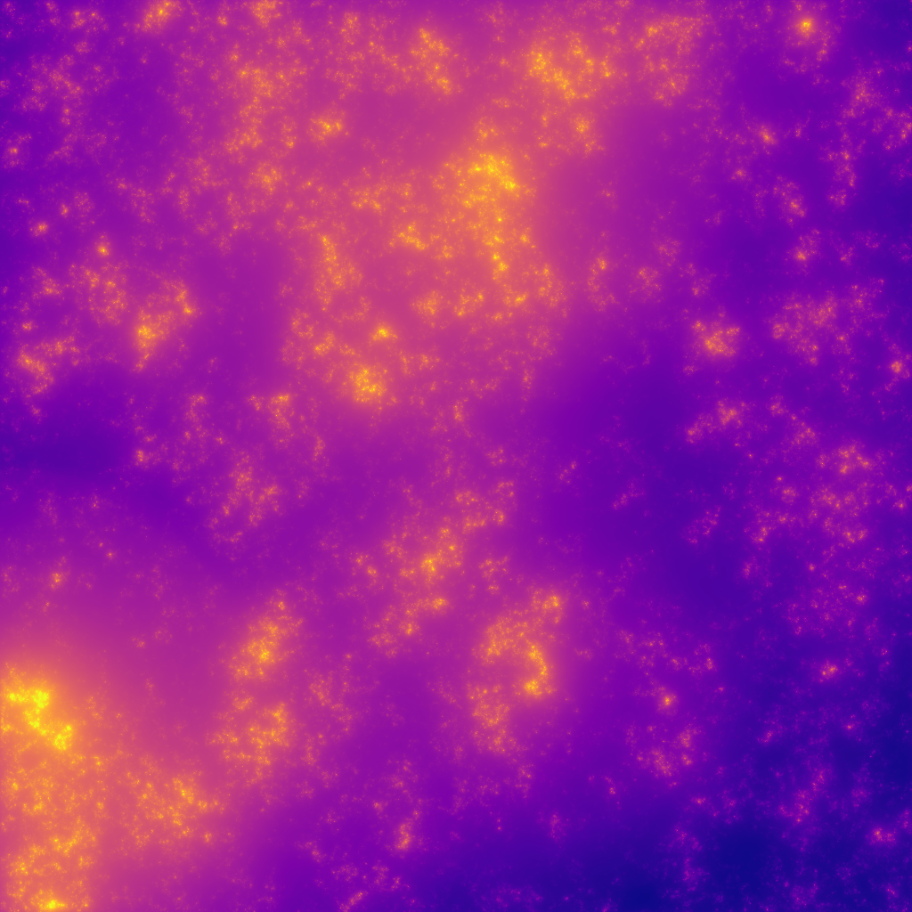

# scaleinvariance



Simulation and analysis tools for scale-invariant processes and multifractal fields.

[Documentation](https://scaleinvariance.readthedocs.io/en/latest/index.html)

View example FIF simulation output in the [Multifractal Explorer](https://thomasddewitt.com/visuals-and-tools/multifractal/index.html)

## Current Features

### Analysis

#### Hurst exponent estimation

- **Haar fluctuation method**: `haar_fluctuation_hurst()`
- **Structure function method**: `structure_function_hurst()`
- **Spectral method**: `spectral_hurst()`

All methods support multi-dimensional arrays, averaging over dimensions that are orthogonal to the specified dimension along which spectra are calculated (specified by `axis`. Data and fit line for plotting may be returned with `return_fit=True`.

### Simulation

- **1D fractionally integrated flux (FIF)**: `FIF_1D()` - Multifractal cascade simulation; causal/acausal
- **N-D fractionally integrated flux (FIF)**: `FIF_ND()` - Isotropic N-D multifractals for arbitrary dimensions (Example shown above)
- **1D fractional Brownian motion**: `fBm_1D_circulant()` - Fast spectral synthesis
- **N-D fractional Brownian motion**: `fBm_ND_circulant()` - Isotropic N-D (2D, 3D, 4D, etc.) fBm fields
- **1D fBm (fractional integration)**: `fBm_1D()` - Extended Hurst range (-0.5, 1.5) with causal/acausal kernels

For FIF simulation methods (`FIF_1D`, `FIF_ND`), the currently supported range is `0.5 <= alpha <= 2` with `alpha != 1`.
The kernel construction method 'LS2010_spectral' is currently recommended for the most accurate outputs, though 'LS2010' (proposed by Lovejoy & Schertzer 2010) can also be superior in some instances.

## Installation

```bash
pip install scaleinvariance
```

#### Agent Skill (Highly Recommended for Agents)

An agent skill is included in this repository. For Claude Code:

```bash
mkdir -p ~/.claude/skills/scaleinvariance
cp .claude/skills/scaleinvariance/SKILL.md ~/.claude/skills/scaleinvariance/
```

Codex:

```bash
mkdir -p ~/.codex/skills/scaleinvariance
cp .claude/skills/scaleinvariance/SKILL.md ~/.codex/skills/scaleinvariance/
```


## Performance

By default, scaleinvariance uses NumPy for all computations. However, if PyTorch is installed, the package automatically detects it and uses PyTorch for simulation functions, providing potentially **huge** performance gains (depending on your machine):

```bash
# NumPy-only installation (minimal dependencies)
pip install scaleinvariance

# With PyTorch for faster simulations
pip install scaleinvariance[torch]
```

Control backend explicitly:

```python
import scaleinvariance

# Check current backend
print(scaleinvariance.get_backend())  # 'torch' if available, else 'numpy'

# Force specific backend
scaleinvariance.set_backend('numpy')  # Always use NumPy
scaleinvariance.set_backend('torch')  # Use torch (raises error if not installed)

# Configure threading (defaults to 90% CPU count)
scaleinvariance.set_num_threads(8)
```

## Basic Usage

```python
from scaleinvariance import fBm_1D_circulant, fBm_ND_circulant, FIF_1D, haar_fluctuation_hurst

# Generate 1D fractional Brownian motion
fBm_1d = fBm_1D_circulant(1024, H=0.7)

# Generate 2D fractional Brownian motion
fBm_2d = fBm_ND_circulant((512, 512), H=0.7)

# Generate 3D fractional Brownian motion
fBm_3d = fBm_ND_circulant((256, 256, 128), H=0.7)

# Generate multifractal FIF timeseries
fif = FIF_1D(2**16, alpha=1.8, C1=0.1, H=0.3)

# Override FIF kernels explicitly if needed
fif_spectral = FIF_1D(
    2**16,
    alpha=1.8,
    C1=0.1,
    H=0.3,
    causal=False,
    kernel_construction_method_flux='LS2010_spectral',
    kernel_construction_method_observable='LS2010_spectral',
)

# Estimate Hurst exponent
H_est, H_err = haar_fluctuation_hurst(fBm_1d)
print(f"Estimated H = {H_est:.3f} ± {H_err:.3f}")
```

## Kernel Selection

For FIF simulations:

- `kernel_construction_method_flux` controls the cascade kernel.
- `kernel_construction_method_observable` controls the final observable kernel.
- Recommended values are `'LS2010'` and `'LS2010_spectral'`.
- The old `kernel_construction_method=` argument is no longer accepted by `FIF_1D` or `FIF_ND`.
- `naive` FIF kernels remain available only for comparison and debugging and emit a warning because they are not remotely accurate.

For fBm:

- `fBm_ND_circulant()` is recommended. It uses a spectral synthesis method and produces essentially perfectly scale invariant fields.
- `fBm_1D()` is included for comparsion or for causal simulations.

## Examples

Work in progress. See [Multifractal Explorer](https://thomasddewitt.com/visuals/multifractal/index.html) for visuals.

Run examples:

```bash
python examples/fif_comparison_demo.py
```

Data source for LGMR: https://www.ncei.noaa.gov/access/paleo-search/study/33112

## Testing

Tests are organised into three directories under `tests/`:

| Directory           | Purpose                                                                                                                     | How to run                           |
| ------------------- | --------------------------------------------------------------------------------------------------------------------------- | ------------------------------------ |
| `tests/functional/` | Sanity checks and gross-accuracy tests. Should always pass.                                                                 | `pytest`                             |
| `tests/numerical/`  | Theory-validation scripts run directly as Python programs. Some produce failures due to finite-size/discretization effects. | `python tests/numerical/<script>.py` |
| `tests/visual/`     | Scripts that generate plots for manual inspection.                                                                          | `python tests/visual/<script>.py`    |


FIF validation scripts, which test scaling over multiple ranges of scale, live in `tests/numerical/`. They are designed to be run as standalone Python programs, not via `pytest`, and they generate many large FIF realizations to reach statistical convergence. These scripts are also known to produce some failures, especially near grid scales, because finite-size effects are not fully mitigated by the LS2010 corrections or their spectral alternatives.

Run the functional suite:

```bash
pytest
```

Run a specific visual test:

```bash
python tests/visual/test_1D_fif_structure_function.py 0.3 0.1 1.8
```

## Requirements

- Python ≥ 3.8
- NumPy, SciPy
- PyTorch (optional, for simulation speedup)
